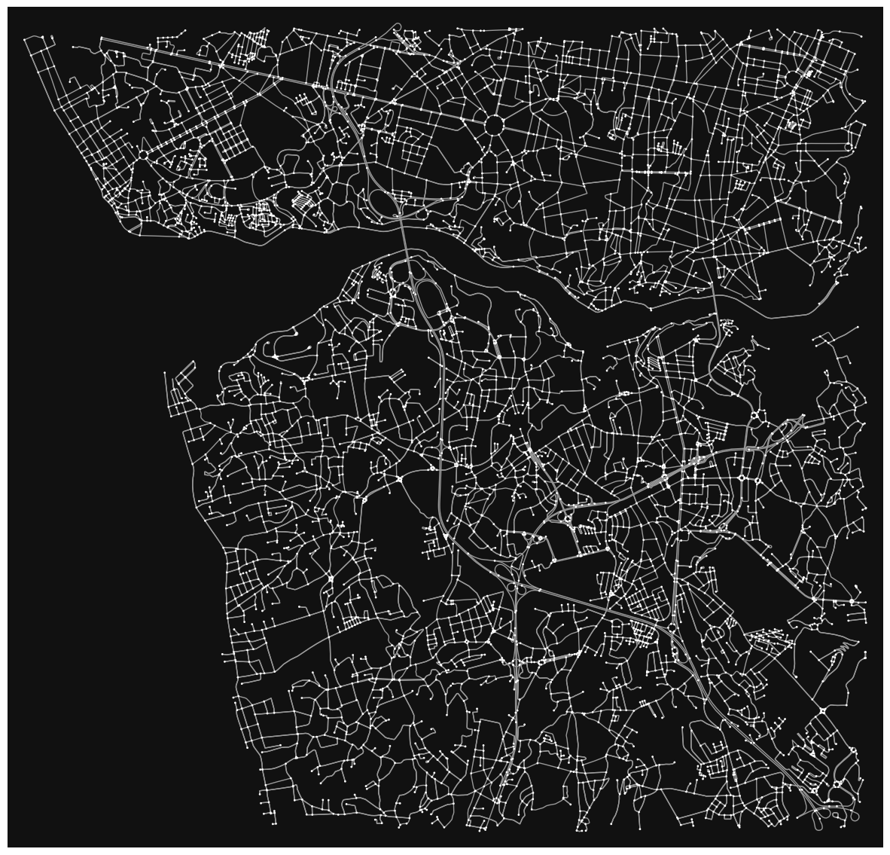
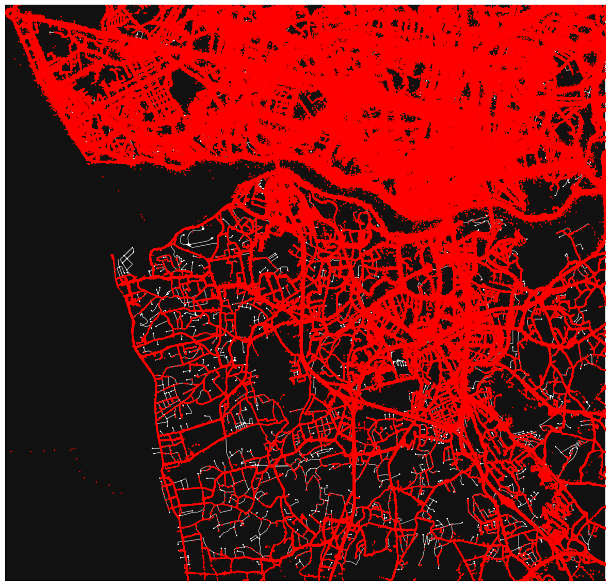
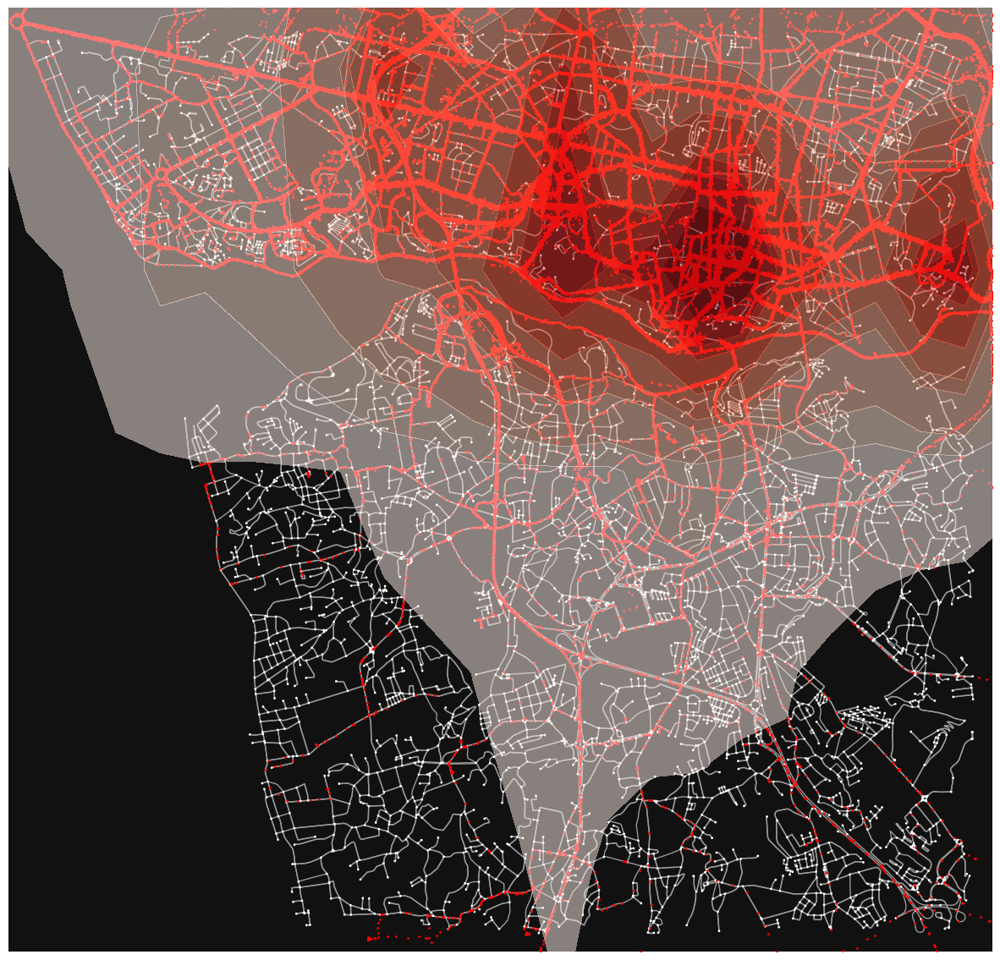
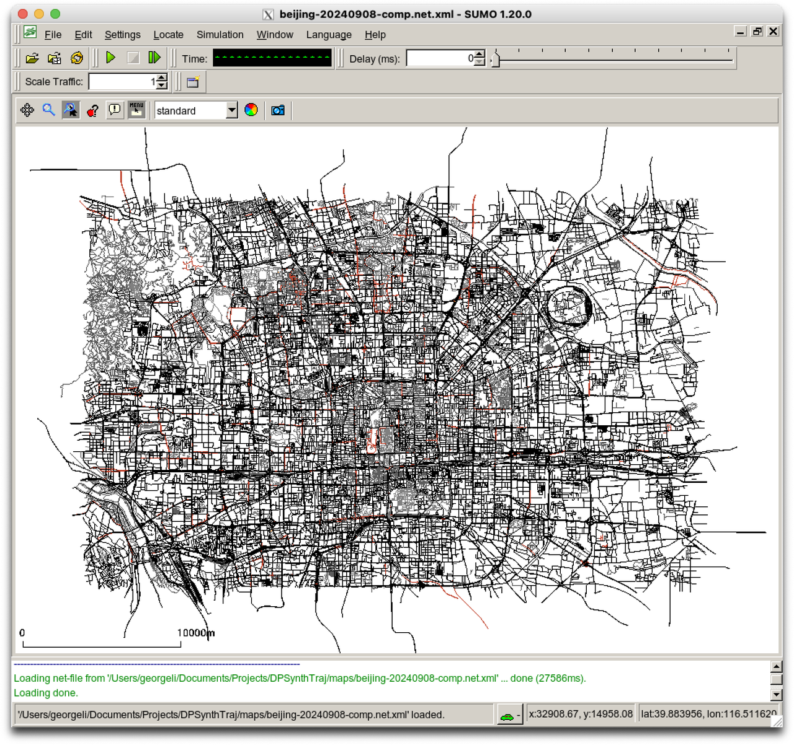
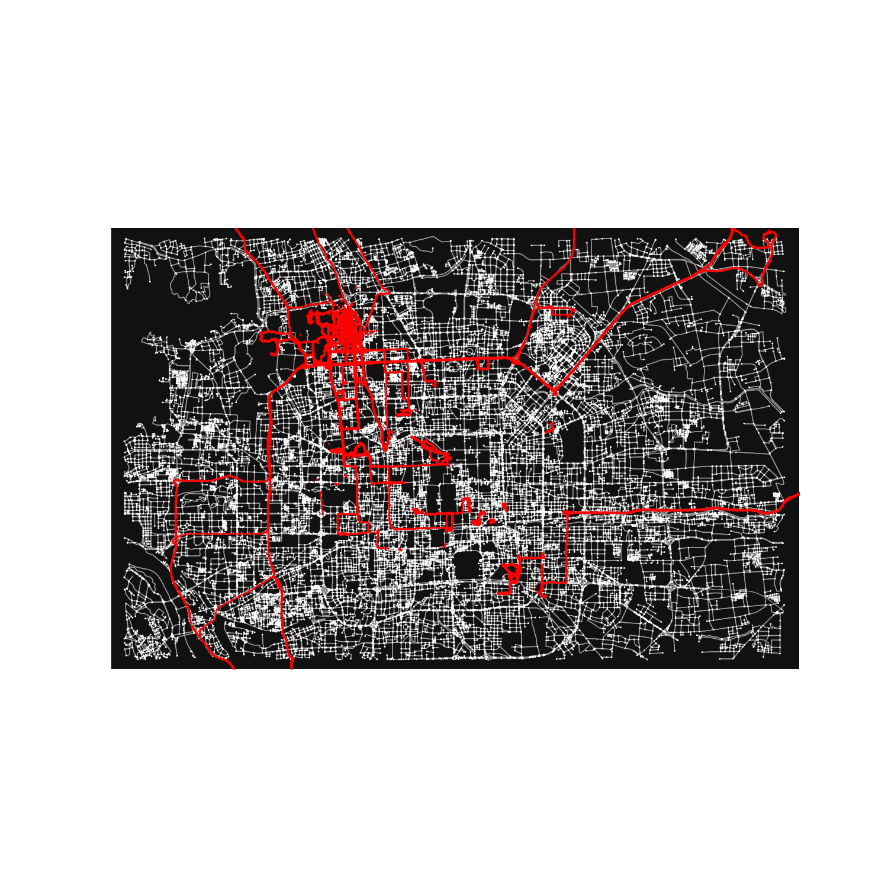
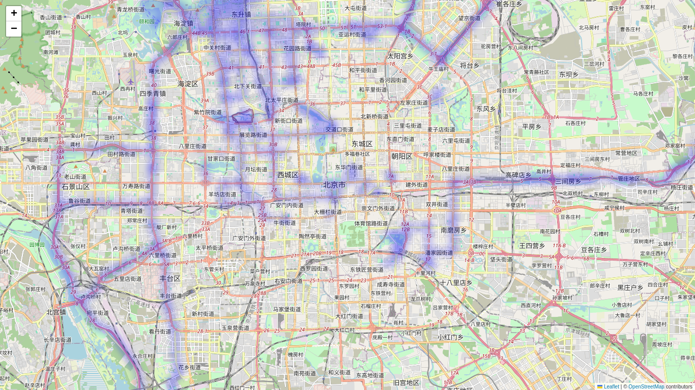
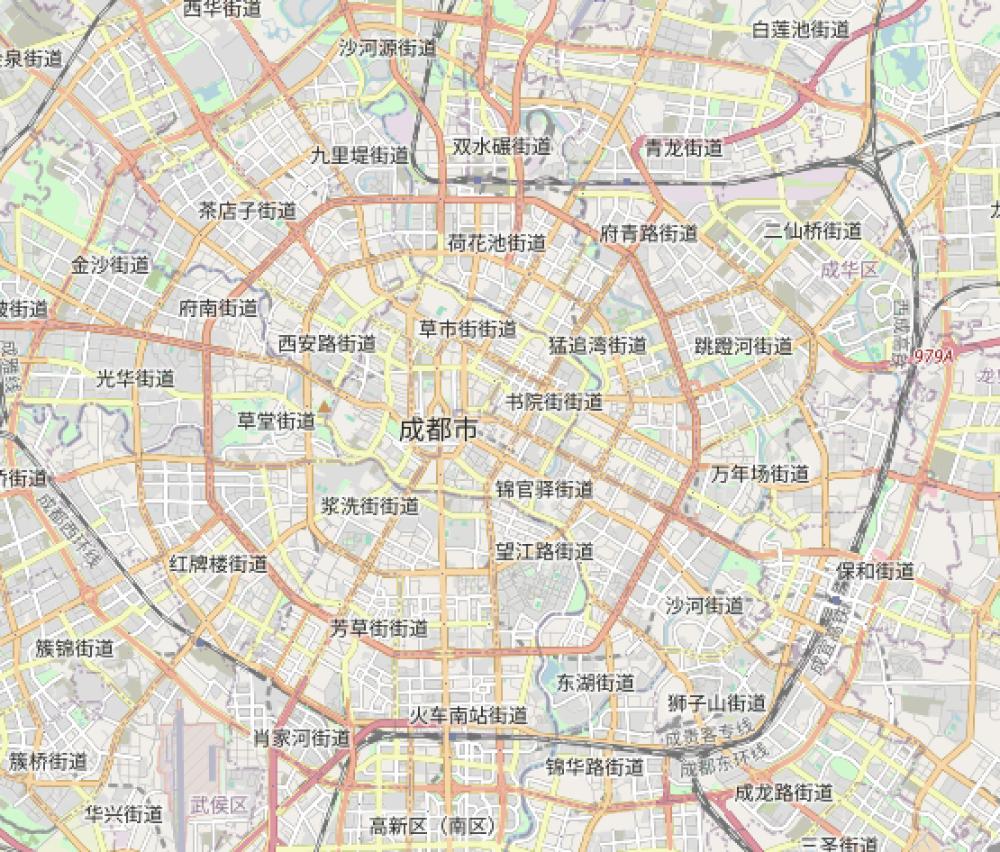
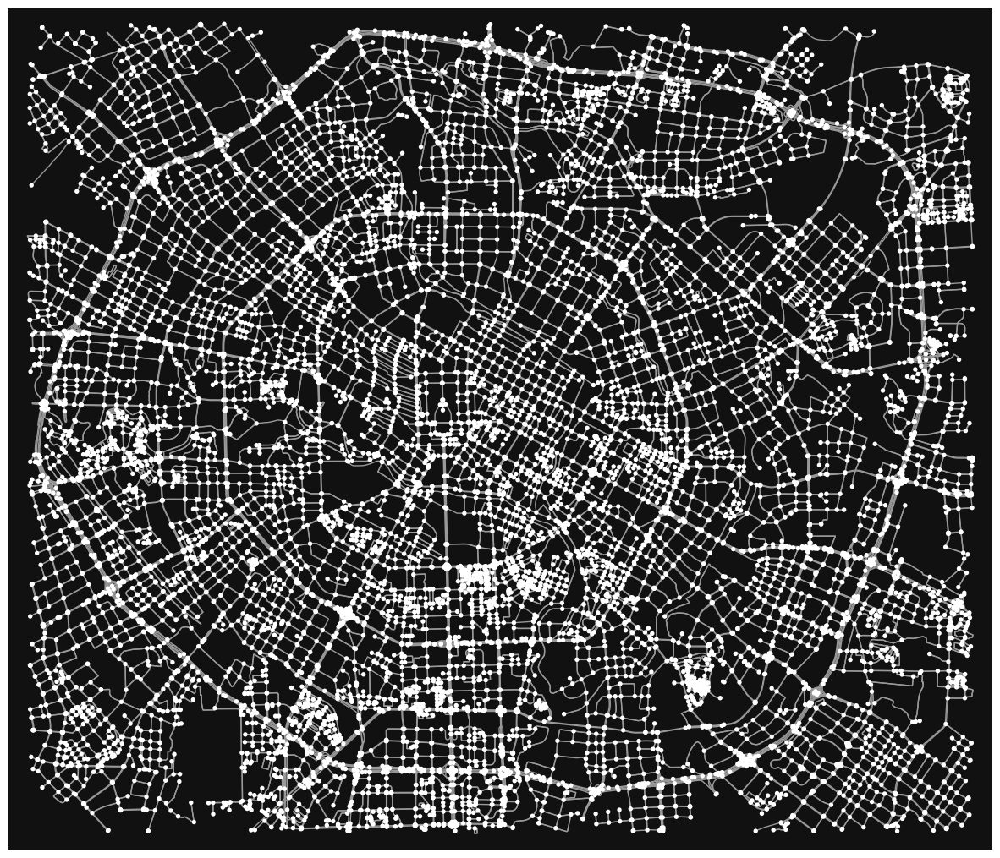

#  Trajectory Data Research

# Background

This repository maintains the latest updates (datasets, papers, codes) on trajectory data research, from trajectory classification, clustering, outlier detection, to pattern mining (single and group movement behavior analysis, trajectory prediction, frequent / periodic sequential patterns, etc). This page will also focus on privacy preserving trajectory data collection/publication, including fields such as k-anonmity, differential privacy, and synthesis.

This repository also contains
- Overview of popular datasets in this research field (and where to find them)
- Explanatory data analysis on some of the popular datasets
- Categorize and structure on going research in this field
- Experiments to implement or re-implement methods introduced in the different applications of this research field, hopefully to perform some comparisons.
- And more!

Maintained by AkaCoder404. Feel free to make pull requests to add new resources!

<div style="text-align: center;">
  <table>
    <tr>
      <td></td>
      <td></td>
      <td></td>
    </tr>
    <tr>
      <td></td>
      <td></td>
      <td></td>
    </tr>
    <tr>
      <td></td>
      <td></td>
      <td></td>
    </tr>
  </table>
</div>

# Project Structure
- `code/` - contains code to run and evaluate state of art methods.
- `docs/` - contains information docs about diffiferent methods, datasets, etc.
- `vis/` - contains mostly `.ipynb` files to visualize specific datasets and do some exploratory data analysis (EDA) on them
- `imgs/` - contains saved images
- `config` - contains config files for SUMO
- `datasets.py` - contains code and resources to download various datasets

# Research Landscape
This is an overview of the current research landscape regarding trajectory data. We classify into three general directions: (1) Analysis, (2) Storage and Management, (3) Protection.

## Analysis
### Classification
### Clustering
### Outlier / Anomoly Detection
### Pattern Mining
## Storage & Management
### Retrieval/Indexing
### Compression
## Protection
### Anonymity (K-Anonymity, L-Diversity, T-Closeness)
### Differential Privacy
### Synthetic Data Generation

## Datasets
Here is a collection of trajectory datasets used (and where to download)
| Type           | Datasets | Reference |
| -------------- | -------- | --------- |
| Real           |          |           |
| Semi-Synthetic |          |           |
| Synthetic      |          |           |


## Experimentation
Results

### Classification
Here are results by implementation....

## Environment Setup
### Python
Built with Python 3.12

Use conda to install requirements.
```bash
conda create traj312 python==3.12
conda activate traj312
pip install -r requirements
```

### Environment
Hardware specs:
- CPU Intel(R) Xeon(R) Platinum 8336C CPU @ 2.30GHz
- GPU Nvidia GeForce RTX 4090

### SUMO
Refer to [sumo download documentation](https://sumo.dlr.de/docs/Installing/index.html) for downloading details.

Refer to [sumo tracli documentation](https://sumo.dlr.de/docs/TraCI/Interfacing_TraCI_from_Python.html) for interfacing with sumo using python


```bash
[DPSynthTraj] % sumo
Eclipse SUMO sumo Version 1.20.0
Build features: Darwin-23.0.0 arm64 AppleClang 15.0.0.15000040 Release FMI Proj GUI Intl
Copyright (C) 2001-2024 German Aerospace Center (DLR) and others; https://sumo.dlr.de
License EPL-2.0: Eclipse Public License Version 2 <https://eclipse.org/legal/epl-v20.html>
Use --help to get the list of options.
```


