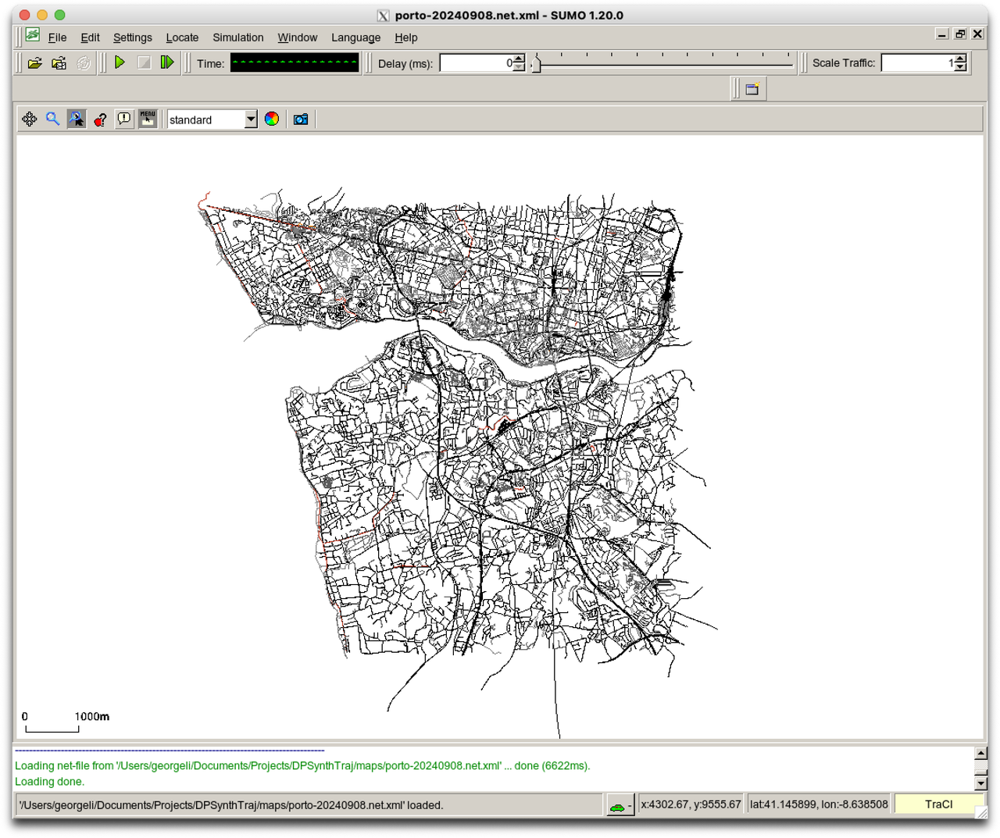

# SUMO Trajectory Visualizer

This repository contains source code to download popular datasets in (privacy-preserving) trajectory data research. Some popular papers are also included for easy reference.

<div style="text-align: center;">
  <table>
    <tr>
      <td></td>
      <td></td>
      <td></td>
    </tr>
    <tr>
      <td></td>
      <td></td>
      <td></td>
    </tr>
    <tr>
      <td></td>
      <td></td>
      <td></td>
    </tr>
  </table>
</div>

## Project Structure
- `vis/` - contains mostly `.ipynb` files to visualize specific datasets and do some exploratory data analysis (EDA) on them
- `config` - contains config files for SUMO
- `datasets.py` - contains code and resources to download various datasets


## Environment Setup
### Python

Use conda to install requirements.
```bash
conda create sumo312 python==3.12
conda activate sumo312
pip install -r requirements
```

### SUMO
Download SUMO. This was run on mac "https://sumo.dlr.de/docs/Installing/index.html#macos". 

```
brew update
brew install --cask xquartz
brew tap dlr-ts/sumo
brew install sumo

In order to let X11 start automatically whenever a GUI-based SUMO application
(e.g., "sumo-gui") is called, you need to log out and in again.
Alternatively, start X11 manually by pressing cmd-space and entering "XQuartz".

Don't forget to set your SUMO_HOME environment variable:
  export SUMO_HOME="/opt/homebrew/opt/sumo/share/sumo"
```

```bash
[DPSynthTraj] % sumo
Eclipse SUMO sumo Version 1.20.0
Build features: Darwin-23.0.0 arm64 AppleClang 15.0.0.15000040 Release FMI Proj GUI Intl
Copyright (C) 2001-2024 German Aerospace Center (DLR) and others; https://sumo.dlr.de
License EPL-2.0: Eclipse Public License Version 2 <https://eclipse.org/legal/epl-v20.html>
Use --help to get the list of options.
```


## Running
Built with Python 3.12


## Datasets
Here is a collection of trajectory datasets used (and where to download)
| Type           | Datasets | Reference |
| -------------- | -------- | --------- |
| Real           |          |           |
| Semi-Synthetic |          |           |
| Synthetic      |          |           |